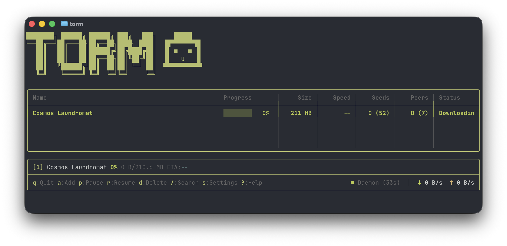

<p align="center">
  
</p>

# Torm

Torm is a terminal-based BitTorrent client built with TypeScript and Ink. It provides both an interactive terminal user interface (TUI) and a command-line interface (CLI) for managing torrents.



## Features

- Full-screen interactive TUI with keyboard navigation
- Command-line interface for scripting and automation
- Background daemon for persistent downloads
- Support for magnet links and .torrent files
- Drag-and-drop support for adding multiple torrents
- Real-time download/upload speed monitoring
- Peer and tracker information display
- Configurable download paths and settings
- Labels for organizing torrents

## Installation

### Quick Install (recommended)

**macOS / Linux:**

```bash
curl -fsSL https://raw.githubusercontent.com/realAndi/torm/main/scripts/install.sh | bash
```

**Windows (PowerShell):**

```powershell
irm https://raw.githubusercontent.com/realAndi/torm/main/scripts/install.ps1 | iex
```

Then run `torm` to launch the TUI.

### From npm

If you have Node.js or Bun installed:

```bash
npm install -g torm
# or
bun install -g torm
```

### From source

```bash
git clone https://github.com/realAndi/torm.git
cd torm
bun install
bun run build
```

## Usage

### Interactive Mode (TUI)

Launch the interactive interface by running:

```bash
torm
```

This opens a full-screen terminal interface for managing your torrents.

#### TUI Keyboard Shortcuts

| Key | Action |
|-----|--------|
| `q` | Quit application |
| `?` | Show/hide help overlay |
| `Up` / `k` | Select previous torrent |
| `Down` / `j` | Select next torrent |
| `Enter` | Open torrent details |
| `Escape` | Go back / clear search |
| `a` | Add new torrent |
| `d` | Delete selected torrent |
| `p` | Pause selected torrent |
| `r` | Resume selected torrent |
| `L` | Edit labels |
| `S` | Open settings |
| `/` | Focus search bar |
| `Ctrl+C` | Quit (with confirmation) |

#### Detail View

When viewing torrent details, use the number keys to switch tabs:

| Key | Tab |
|-----|-----|
| `1` | General information |
| `2` | Files list |
| `3` | Peers list |
| `4` | Trackers |

### Command Mode (CLI)

Run commands directly without entering the TUI:

```bash
torm <command> [options]
```

#### Available Commands

**Adding Torrents**

```bash
# Add a .torrent file
torm add ubuntu.torrent

# Add a magnet link (use quotes)
torm add "magnet:?xt=urn:btih:..."

# Add with custom download path
torm add ubuntu.torrent ~/Downloads

# Add from clipboard
torm add -c

# Add from clipboard with custom path
torm add -c ~/Movies
```

**Listing Torrents**

```bash
# List all torrents
torm list

# Aliases
torm ls
```

**Torrent Information**

```bash
# Show detailed torrent info
torm info <id>

# Alias
torm show <id>
```

**Controlling Torrents**

```bash
# Pause a torrent
torm pause <id>
torm stop <id>

# Resume a torrent
torm resume <id>
torm start <id>

# Verify/recheck pieces
torm verify <id>
torm recheck <id>
```

**Removing Torrents**

```bash
# Remove torrent (keeps files)
torm remove <id>

# Remove torrent and delete files
torm remove <id> --delete-files

# Skip confirmation prompt
torm remove <id> -f
torm remove <id> --force

# Aliases
torm rm <id>
torm delete <id>
```

**Daemon Management**

Torm runs a background daemon to manage downloads:

```bash
# Start the daemon
torm daemon start

# Check daemon status
torm daemon status

# Stop the daemon
torm daemon stop

# Restart the daemon
torm daemon restart
```

#### CLI Options

| Option | Description |
|--------|-------------|
| `-v, --version` | Show version number |
| `-h, --help` | Show help |
| `-c, --clipboard` | Read torrent/magnet from clipboard |
| `-o, --download-path` | Set download path |
| `-f, --force` | Skip confirmation prompts |
| `--delete-files` | Delete files when removing torrent |
| `--verbose` | Show verbose output |

## Configuration

Torm stores configuration and data in your home directory:

- **Config**: `~/.config/torm/` (Linux/macOS)
- **Downloads**: Default download directory is configurable via settings

Access settings through the TUI by pressing `S` or configure via the config file.

## Architecture

Torm is organized into three layers:

- **Engine**: Core BitTorrent protocol implementation (tracker communication, peer management, piece selection, disk I/O)
- **CLI**: Command routing and argument parsing
- **UI**: Interactive terminal interface built with Ink/React

## Known Issues

- Torrents may occasionally need to be deleted twice from the list. This is a known issue being investigated.

## Development

```bash
# Install dependencies
bun install

# Run in development mode
bun run dev

# Build
bun run build

# Run tests
bun run test

# Lint
bun run lint

# Format code
bun run format
```

## Contributing

Contributions are welcome. Please read [CONTRIBUTING.md](CONTRIBUTING.md) for guidelines.

## Acknowledgments

Torm is built on the shoulders of giants. Thanks to these projects and their maintainers:

### Core Dependencies

- **[Ink](https://github.com/vadimdemedes/ink)** by Vadim Demedes - React for CLIs, the foundation of Torm's terminal UI
- **[React](https://react.dev)** by Meta - The declarative UI paradigm that makes the TUI possible
- **[meow](https://github.com/sindresorhus/meow)** by Sindre Sorhus - CLI argument parsing done right
- **[geoip-lite](https://github.com/geoip-lite/node-geoip)** - IP geolocation for peer country flags
- **[ink-scroll-list](https://github.com/nickmccurdy/ink-scroll-list)** - Scrollable lists for Ink

### Runtime & Tooling

- **[Bun](https://bun.sh)** by Oven - The fast JavaScript runtime that powers Torm
- **[TypeScript](https://www.typescriptlang.org)** by Microsoft - Type safety for the entire codebase
- **[Vitest](https://vitest.dev)** - Fast unit testing framework

### Protocol References

Torm implements the BitTorrent protocol from scratch, guided by:

- **[BEP 3](https://www.bittorrent.org/beps/bep_0003.html)** - The BitTorrent Protocol Specification
- **[BEP 9](https://www.bittorrent.org/beps/bep_0009.html)** - Extension for Peers to Send Metadata Files
- **[BEP 10](https://www.bittorrent.org/beps/bep_0010.html)** - Extension Protocol
- **[BEP 11](https://www.bittorrent.org/beps/bep_0011.html)** - Peer Exchange (PEX)
- **[BEP 15](https://www.bittorrent.org/beps/bep_0015.html)** - UDP Tracker Protocol

## License

Torm is licensed under the [GNU Affero General Public License v3.0](LICENSE) (AGPL-3.0).

This ensures the project remains open source and improvements stay accessible to the community.

## Disclaimer

Torm is a BitTorrent client implementing an open protocol. Users are responsible for complying with applicable laws and regulations in their jurisdiction.
